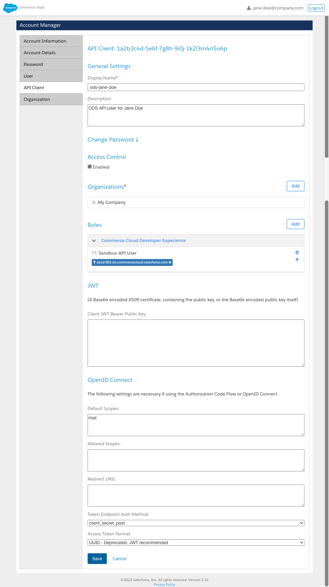

**[↤ Getting Started](../README.md)**

Create API Client
===

> If you have not already created your API Client ID, you'll need to do that to use this tool.

Sorry in advance for this one. It's a beast, but you only have to do it once ;)

1. Visit the [API Client](https://account.demandware.com/dw/account/APIAdmin) Tab on your SFCC [Account Manager](https://account.demandware.com/dw/account/Home) `*`
2. Click `Add API Client` button in the top right
3. For `Display Name`, enter something that identifies your Sandbox, e.g., `ods-jane-doe`
4. For `Description`, write something helpful, e.g., `ODS API User for Jane Doe`
5. Enter a secure password for `Password` ( this is your `SFCC_OAUTH_CLIENT_SECRET` )
6. For `Access Control`, check the `Enabled` checkbox
7. Click the `Add` button on `Organizations`
8. Select the checkbox next to your Organization's name
9. Click the `Add` button to Assign the Organization
10. Click the `Add` button on `Roles`
11. Select the checkbox for `Sandbox API User`
12. Click the `Add` button to Assign the Role
13. Click the Filter Icon to the right of the `No role scope defined`
14. Select your Organization from the list
15. Choose your Sandbox from the select list
16. Click the `Add` button to add your Sandbox as a Sandbox API User
17. Set `Token Endpoint Auth Method` to `client_secret_post`
18. Set `Access Token Format` to `UUID - Deprecated. JWT recommended`
19. You can leave everything else with default settings
20. Press `Save`

After Saving, you will be returned to the API Clients ID list. Find the one you just created and open it. At the top of the page, you will see your `API Client`.

*Screenshot:*

`*` **NOTE:** If you do not see the `API CLient` tab after logging into your Account Manager, contact your Administrator to get access.  You will not be able to use this tool without these credentials.  They may be able to set this up for you using the instructions above if they are unwilling to give you direct access.

### You will only need the following information to use this tool:

* `SFCC_OAUTH_CLIENT_ID` ( API Client ID )
* `SFCC_OAUTH_CLIENT_SECRET` ( Password used when creating the Client ID )
* `SFCC_SANDBOX_ID` ( Sandbox UUID used by this tool )

---

 &nbsp; 
