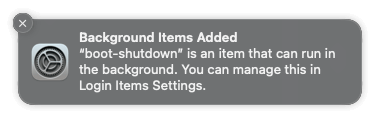
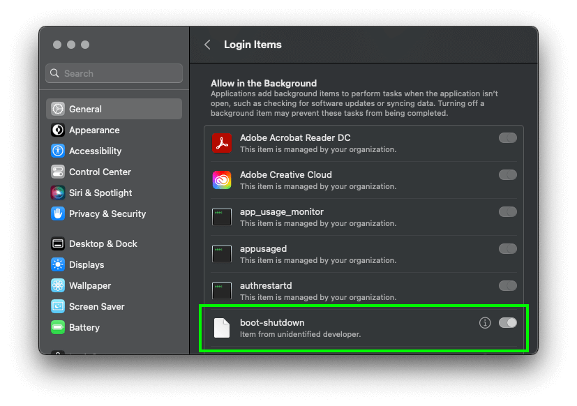

**[↤ Getting Started](../README.md)**

Install Launch Agents
===

> All we have left to do now is install the Launch Agents to handle starting & stopping your sandbox.

```bash
# Run Installer
./install
```

Security Overview
---

> Your companies IT Department might want to know a few things about what this tool is doing.

### Overview

**NOTE:** This tool does not require a superuser or root level access to install.

Our [./install](../install) script does the following:

1. Uses [Homebrew](https://brew.sh) to install [sleepwatcher](https://formulae.brew.sh/formula/sleepwatcher) to add event listeners for Awake & Sleep states
2. Adds [sdx-start](../bin/sdx-start) bash script to start a Sandbox after a computer boots or wakes up
3. Adds [sdx-stop](../bin/sdx-stop) bash script to stop a Sandbox when computer shuts down or goes to sleep
4. Adds [boot-shutdown](../bin/boot-shutdown) bash script to call above scripts on shutdown and boot
5. Adds [com.sfccdevops.sleepwatcher.plist](../launchd/com.sfccdevops.sleepwatcher.plist) Launch Agent for Sleepwatcher events
6. Adds [com.sfccdevops.sandbox.plist](../launchd/com.sfccdevops.sandbox.plist) Launch Agent for Boot and Shutdown events

### Installation Prompts

After running the installer, you will see a notice for a new Background Items entry for [boot-shutdown](../bin/boot-shutdown).  This was registered by the [com.sfccdevops.sandbox.plist](../launchd/com.sfccdevops.sandbox.plist) launch agent when we requested to be notified when the computer started up, or is about to shut down.



Clicking this notice will open the Login Items, where you will see our [boot-shutdown](../bin/boot-shutdown) script listed.



---

[](./fetch-sandbox-uuid.md) &nbsp; [](../README)
